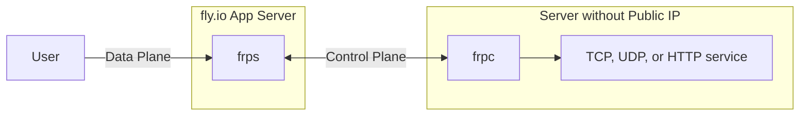

# frp on fly.io
[Fast reverse proxy](https://github.com/fatedier/frp) on [fly.io](https://fly.io)

Run your own frp tunnel for free (within free tier) on fly.io

Now you can have ngrok TCP/UDP tunnel with the ports you want, not randomly generated ports on ngrok unless you [pay for the pro monthly](https://ngrok.com/pricing).



## fly.io Deployment
### GitHub Codespaces

1. Fork this repository.
2. On your own fork, click Code, and click Codespaces tab.
3. Click "Create codespace on main".
4. Check if frp version in `Dockerfile` is latest, if not, change to the latest version.
5. Login to flyctl by using `fly auth login` or you can generate [access tokens](https://fly.io/user/personal_access_tokens) and paste it to `FLY_API_TOKEN` in Codespaces secrets.
6. Create an app on fly.io `fly launch --copy-config --name app-name --no-deploy`.
7. Select the region closest to you.
8. Set environment variables for frp server. `fly secrets set -a app-name FRP_TOKEN=12345678 FRP_DASH_USER=admin FRP_DASH_PWD=admin`
9. Deploy to fly.io `fly deploy -a app-name --remote-only`.
10. When asked to allocate a dedicated IPv4 address, yes.
11. Try to connect to frps using the [example frpc.toml](#example-frpctoml).

### Local
You need [flyctl](https://github.com/superfly/flyctl) installed.

1. Clone this repository.
2. Check if frp version in `Dockerfile` is latest, if not, change to the latest version.
3. Login to flyctl by using `fly auth login`.
4. Create an app on fly.io `fly launch --copy-config --name app-name --no-deploy`.
5. Select the region closest to you.
6. Set environment variables for frp server. `fly secrets set -a app-name FRP_TOKEN=12345678 FRP_DASH_USER=admin FRP_DASH_PWD=admin`
7. Deploy to fly.io `fly deploy -a app-name --remote-only`.
8. When asked to allocate a dedicated IPv4 address, yes.
9. Try to connect to frps using the [example frpc.toml](#example-frpctoml).

Don't forget to change the `app-name` and the `FRP_TOKEN` so that others can't use your frp tunnel.

You can also view https://app-name.fly.dev in browser to view the frps dashboard.

## Change server configuration
Type `fly deploy -a app-name --remote-only` on the repository after editing frps.ini

## Switch
fly.io runs app 24/7, if you are not using your tunnel for a while, it is recommended to suspend it to conserve free tier and resources.

* Suspend frp `fly scale count 0 -a app-name`
* Resume frp `fly scale count 1 -a app-name`

## TCP or UDP tunnel, not both
Since in fly.io, it is [required to bind to `fly-global-services`](https://fly.io/docs/app-guides/udp-and-tcp/#the-fly-global-services-address) in order for UDP to work, but frp `proxy_bind_addr` only allow to bind in one address, so we need to disable TCP if you want to use UDP as TCP does not work on `fly-global-services`.

You need to have a separate frp instance if you need to tunnel both TCP and UDP. One for TCP using `proxy_bind_addr = 0.0.0.0` and one for UDP using `proxy_bind_addr = fly-global-services`.

## KCP Protocol
[KCP](https://github.com/skywind3000/kcp/blob/master/README.en.md) (a protocol built on UDP) is used by default and to reduce latency (like for game servers).

You can also use TCP if KCP is not working for you. Check the [wiki](https://github.com/AnimMouse/frp-flyapp/wiki/Use-TCP-in-control-plane) for tutorial.

## XTCP P2P
You can use this frp tunnel like a STUN server. `bind_addr` should be set in `fly-global-services` in order for XTCP to work. This feature is enabled by default.

## Example frpc.toml
```toml
serverAddr = "app-name.fly.dev"
auth.token = "12345678"

# KCP connection
serverPort = 7000
transport.protocol = "kcp"

# QUIC connection
#serverPort = 7001
#transport.protocol = "quic"

# TCP tunnel, requires proxyBindAddr = "0.0.0.0" in frps.ini
[[proxies]]
name = "minecraft-java"
type = "tcp"
localIP = "127.0.0.1"
localPort = 25565
remotePort = 25565

# UDP tunnel, requires proxyBindAddr = "fly-global-services" in frps.ini
#[[proxies]]
#name = "minecraft-bedrock"
#type = "udp"
#localIP = "127.0.0.1"
#localPort = 19132
#remotePort = 19132
```

### fly.io free tier
fly.io requires a credit card in order to work, if you don't have a credit card or if you are afraid that fly.io will charge you so much, it is recommended to buy prepaid credits that can be used with virtual credit cards.

### HTTP tunneling
If you are tunneling HTTP apps instead of TCP/UDP, I recommend to just use [Cloudflare Tunnel](https://www.cloudflare.com/products/tunnel/).\
You can also tunnel HTTP apps on this frp by using a custom port like 8080.\
If you need to use standard 80 and 443 port, you need to disable the frps dashboard. Check the [wiki](https://github.com/AnimMouse/frp-flyapp/wiki/HTTP-Tunneling) for tutorial.

### IPv6 support
If you have IPv6, congratulations, [you don't need this tunnel](https://www.reddit.com/r/networkingmemes/comments/sif407/imagine_network_engineers_time_gone_into/).

To allocate IPv6 in fly.io: `fly ips allocate-v6 -a app-name`

To enable IPv6 in control plane, set `bind_addr = ::` in frps.ini. Take note that KCP does not work in IPv6 as [`fly-global-services` does not support IPv6] so you would need to use TCP if you use IPv6 in control plane.

To enable IPv6 in data plane, set `proxy_bind_addr = ::` in frps.ini and `local_ip = ::1` in frpc.ini. Take note that UDP does not work in IPv6 as [`fly-global-services` does not support IPv6] so you can't tunnel UDP in IPv6.

[`fly-global-services` does not support IPv6]: https://fly.io/docs/app-guides/udp-and-tcp/#udp-wont-work-over-ipv6

### More infos
* [anderspitman/awesome-tunneling](https://github.com/anderspitman/awesome-tunneling)

# 🖕 Carrier-grade Network Address Translation (CGNAT)
* [Is NAT a conspiracy?](https://chatgptwith.me/posts/is-nat-a-conspiracy/)